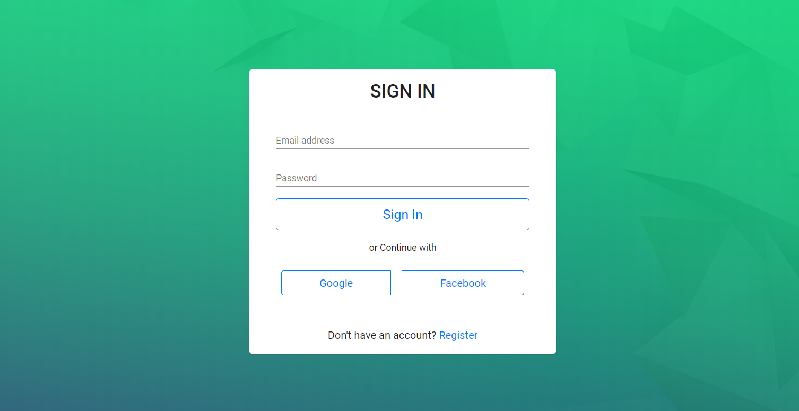
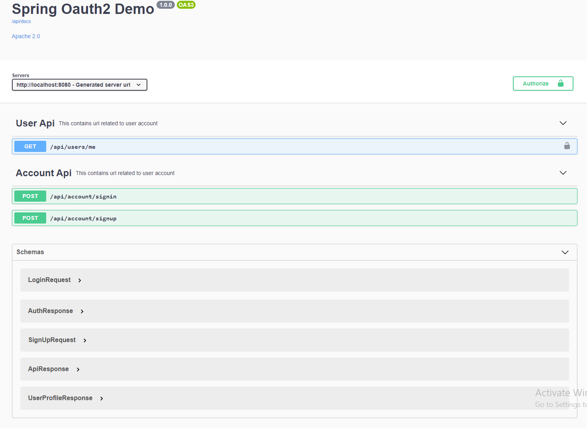
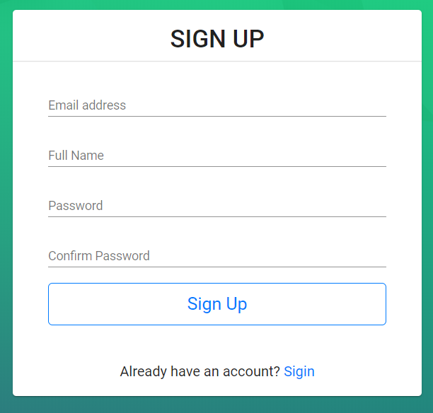
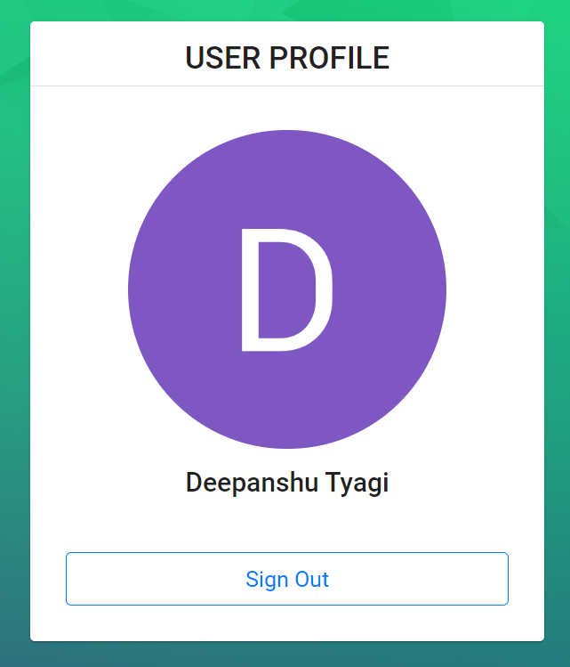

# Spring Boot OAuth2 Social Login

This project on how to implement OAuth2 with JWT tokens using Spring Boot 2 and Angular. MongoDB is used as database for saving database.


## Technologies/Design Decisions

- Backend: Kotlin with Spring Boot
- Frontend: Angular 8
- Database: MongoDB
- ORM: Spring Data
- Security: Spring Security
- Api Documentation: OpenAPI Swagger
- Solid Design Principals.

## Setting Development Environment

Clone or download repository. It's is recommended to use IntelliJ idea or other idle. Than open backend in idle to continue further.

### Setting up the Spring Server

- Create application-local.yaml in resources and copy application-production.yaml
- Replace environment variables with actual values
- Run spring server with gradle command.

### Setting up the Angular Server (frontend)

```bash
cd frontend
npm i
ng serve
```

Spring server start on http://localhost:8080 and Angular server starts on http://localhost:4200.

## API Documentation



Link: http://localhost:8080/swagger-ui/index.html?url=/api/docs&validatorUrl=#/

## Screenshots

<div>
    
    
</div>

## Any questions

If you have any questions, feel free to ask me:

- **Mail**: <a href="mailto:deepanshut041@gmail.com">deepanshut041@gmail.com</a>  
- **Github**: [https://github.com/deepanshut041](https://github.com/deepanshut041)
- **Website**: [https://deepanshut041.github.io](https://deepanshut041.github.io)
- **Twitter**: <a href="https://twitter.com/deepanshut041">@deepanshut041</a>

Don't forget to follow me on <a href="https://twitter.com/deepanshut041">twitter</a>, <a href="https://github.com/deepanshut041">github</a> and <a href="https://medium.com/@deepanshut041">Medium</a> to be alerted of the new articles that I publish